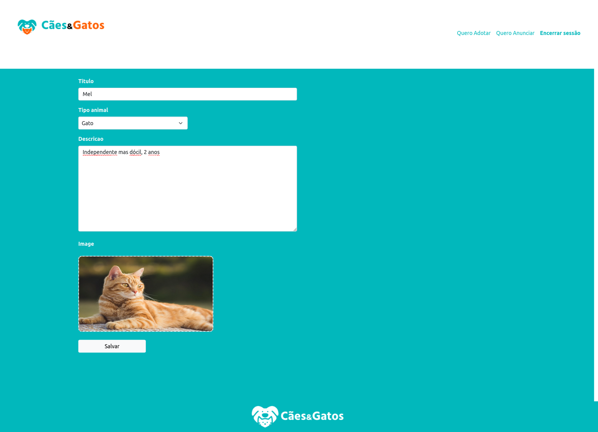

# caes-e-gatos
Site para anunciar ou encontrar animais disponíveis para adoção. 
### Como rodar:
- Crie um virtual enviroment: ```python -m venv nome_do_ambiente```
- Ative: windows = ```.\nome_do_ambiente\Scripts\activate``` |  linux = ```source nome_do_ambiente/bin/activate```
- Instale as libs: ```pip install -r requirements.txt```
- Atualize o banco de dados: ```python manage.py migrate```
- Inicie o sistema: ```python manage.py runserver```
<br><br>
<br>
<br>


